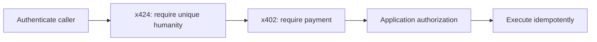

# x424

[](https://github.com/x424protocol/x424/actions/workflows/ci.yml)
[](LICENSE)

> Human Dependency Protocol · x424/0.1 developer preview · unaudited

**x424 makes unique humanity a native HTTP dependency—for users, agents, and
APIs.** A resource can require one explicitly accepted unique human without
turning any provider into a universal identity authority.

[10-minute quickstart](docs/QUICKSTART.md) · [Current status](docs/STATUS.md) ·
[Protocol](docs/PROTOCOL.md) · [Adoption guide](docs/ADOPTION.md) ·
[Roadmap](docs/ROADMAP.md) · [Security](docs/SECURITY.md) ·
[OpenAPI](openapi/x424.openapi.json)

## Why x424

Products that require unique humanity repeatedly rebuild the same HTTP
machinery around provider SDKs: challenge discovery, request binding, provider
handoff, verifier submission, replay prevention, result validation, and retry.

x424 makes that machinery reusable. A resource names the exact provider methods
it accepts. A human completes one method. A verifier returns a short-lived
result bound to the request and caller. The client retries with that result.

| Requirement                                                      | Use                            |
| ---------------------------------------------------------------- | ------------------------------ |
| Login or enroll with one provider                                | Use that provider directly     |
| Require one accepted unique human before an HTTP action executes | Use x424                       |
| Require unique humanity before payment                           | Compose x424 before x402       |
| Decide whether the caller may perform the action                 | Keep application authorization |

When a service also requires payment, the layers stay independent:



x424 standardizes the dependency, not the underlying proof system. It does not
define a human identity, equate providers, create an account, or authorize the
application action.

World is the first maintained provider profile. It proves its own exact claim;
x424 does not rename World, parse its proof in application code, or turn it
into a universal identity authority. Providers prove uniqueness, x424
standardizes the dependency, and the application remains the authorization
authority.

## Adoption promise

For a supported provider, an adopter should supply only:

- provider credentials and environment;
- accepted methods and freshness policy;
- the authenticated wallet, session, request, or agent-key binding;
- provider UI appropriate to its platform; and
- application authorization and idempotency.

x424 should own the wire protocol, signed provider request construction, proof
submission, strict verification, privacy boundary, replay controls, result
signing, and client retry. The measurable boundary is defined in the
[adopter contract](docs/ADOPTER_CONTRACT.md).

## Wire flow

```text
Client or agent                   Resource server               x424 verifier
    | POST /action                      |                            |
    |---------------------------------->|                            |
    | 424 + HUMAN-REQUIRED              |                            |
    |<----------------------------------|                            |
    | human completes one accepted provider method                  |
    | POST provider-native proof ----------------------------------->|
    |<--------------------------- HUMAN-RESULT (signed, short-lived) |
    | POST /action + HUMAN-PROOF       |                            |
    |---------------------------------->| verify signature, request, |
    |                                  | audience, binding, replay  |
    | 2xx, or next dependency such as x402                           |
    |<----------------------------------|                            |
```

```http
HTTP/1.1 424 Failed Dependency
HUMAN-REQUIRED: <base64url-canonical-json>
Cache-Control: no-store, private
Vary: HUMAN-PROOF
Content-Type: application/problem+json
```

The retry carries the verifier result, never a raw provider proof:

```http
POST /action HTTP/1.1
HUMAN-PROOF: <x424-result+jws>
Idempotency-Key: <application-key-for-mutations>
```

## Current status

x424/0.1 is an **unaudited developer preview**, not a production security
certification or accepted global standard. The repository includes:

- canonical requirement/result codecs and request digests;
- exact audience, purpose, time, request, and caller binding;
- Ed25519 signed results and pairwise human identifiers;
- atomic-store interfaces plus Redis-backed requirement, dependency,
  provider-subject, handoff, replay, and same-operation result-acceptance
  state, with PostgreSQL parity;
- a provider-adapter SDK and fixed negative conformance vectors;
- a reusable World verifier profile with signed RP requests, built-in signal
  binding, and an explicit legacy Orb fallback method;
- a generic HTTP verifier resolver and one-challenge/one-retry client;
- maintained Express, Fetch, and Next.js resource adapters;
- authenticated managed-verifier issuance/state/replay/handoff clients;
- provider-neutral brokered human handoff and a World IDKit adapter;
- RFC 9421-style agent request signing for Ed25519, EIP-191, and ERC-1271;
- `createX424AgentClient()` plus terminal, callback, NDJSON, and safe CLI
  presenters;
- deterministic x424-before-x402 server and client composition with
  same-operation acceptance;
- a runnable non-root Redis verifier image and Helm chart;
- a signed public `ghcr.io/x424protocol/x424-verifier:0.1.0` image with
  provenance and SBOM attestations;
- an Express verifier router, OpenAPI 3.1, JSON Schemas, and MCP server; and
- a no-build dependency console.

It does not yet include a public managed service/console, completed external
security review, published real-World staging matrix, or independent
implementation. Deployability is not the 0.2 production gate. See the
[current evidence matrix](docs/STATUS.md) and [roadmap](docs/ROADMAP.md) before
making production or standards claims.

## Run the complete local flow

The one-time npm owner bootstrap is still pending. Install the signed-tag
release artifact directly from GitHub:

```bash
npm install https://github.com/x424protocol/x424/releases/download/v0.1.0/x424-0.1.0.tgz
```

The source quickstart exercises
`424 → provider proof → signed result → exact retry → 201` with synthetic World
fixtures:

```bash
git clone https://github.com/x424protocol/x424.git
cd x424
corepack enable
pnpm install
pnpm quickstart
```

This is an automated local evaluation flow, not real World verification. Read
the [ten-minute quickstart](docs/QUICKSTART.md) for what it proves and the path
to World staging, self-hosted Redis, framework, and x402 integrations.

After npm owner bootstrap, the supported registry install command will be:

```bash
pnpm add x424
```

The repository requires Node.js 22+ and pnpm 9+.

## Package surfaces

The package keeps the provider-neutral kernel separate from integrations:

```ts
import { createHumanRequirement } from "x424/core";
import { createX424 } from "x424";
import { createHttpHumanDependencyResolver, fetchWithX424 } from "x424/client";
import { defineHumanProviderAdapter } from "x424/adapters";
import {
  WorldIdAdapter,
  createWorldIdMethodRequirements,
  worldProofOfHuman,
} from "x424/world";
import {
  createWorldIdIdKitProofResolver,
  createWorldIdProofRequest,
} from "x424/providers/world-id/client";
import { RedisX424Store } from "x424/redis";
import {
  createExpressHumanDependencyMiddleware,
  createX424HttpRouter,
} from "x424/express";
import { createFetchX424Handler } from "x424/fetch";
import { createNextX424Handler } from "x424/next";
import { ManagedVerifierClient } from "x424/managed";
import { fetchWithX424AndX402 } from "x424/x402";
import { createX424McpServer } from "x424/mcp";
```

## World Proof of Human profile

The World profile uses one `proofOfHuman` ceremony. It generates the RP
signature on the trusted backend, uses the x424 binding as the World signal,
forwards the IDKit result without reshaping it, and accepts only a matching
World verification result.

Create the reusable profile once:

```ts
import { worldProofOfHuman } from "x424/world";

const world = worldProofOfHuman({
  appId: process.env.WORLD_APP_ID!,
  rpId: process.env.WORLD_RP_ID!,
  signingKeyHex: process.env.WORLD_RP_SIGNING_KEY!,
  action: "publish-record",
  environment: "production",
  allowLegacyProofs: true,
});

// world.catalog and world.adapter configure X424Service.
// world.accepts and world.providerRequests configure requirement issuance.
```

For a managed verifier, the same backend-generated `world.providerRequests`
is submitted through authenticated issuance. The RP signing key stays in the
adopter backend; only signed request material crosses the verifier boundary.

The signing key never enters `providerRequests`. With legacy enabled, IDKit may
complete the same ceremony with either `world:proof-of-human@1` (v4) or
`world:orb-legacy@1` (v3). The resolver labels the actual outcome before proof
submission, and the signed x424 result preserves that exact method. A client
cannot enable fallback unless the requirement, signed provider request, and
verifier profile all allow it.

The two methods deliberately produce different pairwise IDs and do not claim
cross-version deduplication. Applications that accept both for one long-lived
participation namespace must retain their existing cross-version policy. x424
does not pretend that different World nullifiers identify the same person.

World uniqueness is scoped to the RP and registered World action—not to the
x424 dependency ID or signal. Reusing one World action therefore means one
successful participation per human in that action, not one proof per HTTP
request. Choose actions as real uniqueness domains.

## Shared verifier state

The Express router accepts a shared `RequirementStore`. The Redis runtime
provides requirement, dependency nonce, provider replay, and result stores
through one configured client:

```ts
import { createClient } from "redis";
import { RedisX424Store } from "x424/redis";

const redis = createClient({ url: process.env.REDIS_URL });
await redis.connect();

const state = new RedisX424Store({ client: redis });

// X424Service({
//   nonceStore: state.nonces,
//   providerReplayStore: state.providers,
//   ...
// })
// createX424HttpRouter({ requirementStore: state.requirements, ... })
// verifyHumanProofHeader({ replayStore: state.results, ... })
```

Redis 6.2+ supplies atomic state; the operator still owns topology, access
control, monitoring, backup, and failure testing.

## Client composition

Applications decide how to display or deep-link the provider's connector URI.
x424 builds the IDKit request, collects its exact result, submits it to the
verifier, extracts the signed result, and retries the original request:

```ts
import { createHttpHumanDependencyResolver, fetchWithX424 } from "x424/client";
import { createWorldIdIdKitProofResolver } from "x424/providers/world-id/client";

const resolveHumanDependency = createHttpHumanDependencyResolver({
  verifierUrl: "https://verifier.example.com/",
  resolveProviderProof: createWorldIdIdKitProofResolver({
    onConnectorUri: ({ connectorUri }) => renderQrOrDeepLink(connectorUri),
  }),
});

const response = await fetchWithX424(url, requestInit, {
  resolveHumanDependency,
});
```

The helper retries only when both status `424` and a valid `HUMAN-REQUIRED`
header are present. It never chooses an unlisted provider or treats ordinary
dependency failures as x424.

For endpoints that also use x402, `fetchWithX424AndX402()` enforces the only
supported order: initial `424`, human retry that may receive `402`, then a final
retry carrying separate `HUMAN-PROOF` and `PAYMENT-SIGNATURE` headers. The
server helpers keep humanity middleware before payment middleware and require
normal application idempotency for mutations.

## Managed verifier configuration

The managed service is a separate operator implementation of the public API.
Resource servers switch to it through configuration only:

```ts
import { ManagedVerifierClient } from "x424/managed";

const managed = new ManagedVerifierClient({
  baseUrl: process.env.X424_VERIFIER_URL!,
  headers: () => ({
    authorization: `Bearer ${process.env.X424_PROJECT_TOKEN!}`,
  }),
});

const protection = {
  requirementIssuer: managed,
  requirementStore: managed.requirementStore(),
  replayStore: managed.resultReplayStore(),
  providerRequests: world.providerRequests,
};
```

The client pins the configured origin, refuses redirects, bounds responses,
and never submits provider signing keys.

For production mutations configure both durable stores:

```ts
const protection = {
  requirementIssuer: managed,
  requirementStore: managed.requirementStore(),
  replayStore: managed.resultReplayStore(),
  resultAcceptanceStore: managed.resultAcceptanceStore(),
};
```

## Accept the retried request

```ts
import { defineMethodCatalog, verifyHumanProofHeader } from "x424/core";

const result = await verifyHumanProofHeader({
  humanProof: request.headers["human-proof"],
  requirement: storedRequirement,
  verifier: trustedVerifierPublicKey,
  catalog: defineMethodCatalog(acceptedMethodDescriptors),
  replayStore: sharedAtomicResultStore,
});

// x424 is satisfied. The application still authorizes and executes
// idempotently.
```

For reads, consume `resultId` atomically. For mutations, use
`ResultAcceptanceStore` to bind the result to one `Idempotency-Key` and exact
request digest while the application stores and replays the business result.
x424 prevents a different operation from reusing the human result; it does not
make the business action idempotent by itself.

## Provider adapters

Provider integrations use the public adapter contract without changing core:

```ts
import {
  defineHumanMethodDescriptor,
  defineHumanProviderAdapter,
} from "x424/adapters";

const method = defineHumanMethodDescriptor({
  providerId: "example-provider",
  methodId: "unique-human",
  version: "1",
  status: "enabled",
  claim: "The provider accepted one unique human in its declared scope.",
  nonClaims: ["Legal identity", "Authorization", "Provider equivalence"],
  assuranceLevels: ["standard"],
  nativeScopeKinds: ["relying_party"],
  verificationModes: ["backend"],
  pairwisePseudonym: true,
  replaySemantics: "Provider proof and x424 nonce are single-use.",
  recoverySemantics: "Recovery is controlled by the provider.",
  privacy: "The provider subject remains inside the verifier boundary.",
});

export const adapter = defineHumanProviderAdapter({
  providerId: "example-provider",
  methods: [method],
  validateProviderRequest: ({ providerRequest }) => {
    validateSignedProviderRequest(providerRequest);
  },
  verify: async ({ requirement, proof }) => {
    const native = await verifyWithProvider(proof.nativeProof, requirement);
    return {
      providerId: "example-provider",
      methodId: "unique-human",
      descriptorVersion: "1",
      assuranceLevel: "standard",
      providerSubject: native.privateUniqueSubject,
      uniquenessScope: {
        kind: "relying_party",
        id: native.uniquenessNamespace,
      },
      verificationMode: "backend",
      proofDigest: digestNativeProof(proof.nativeProof),
      verifiedAt: native.verifiedAt,
    };
  },
});
```

Every adapter documents exact claims, non-claims, scope, binding, replay,
recovery, privacy, and execution mode. Installing an adapter never adds it to a
relying-party policy.

## Providers are not interchangeable

x424 does not create a universal human identifier or deduplicate subjects
across providers. A proof from provider A and a proof from provider B may
belong to the same person. A one-person policy that accepts both providers
needs an explicit cross-provider duplicate-participation policy.

Provider alternatives are named trust branches, never an implicit score or
equivalence claim.

## Agents and humans

x424 can bind a result to an agent public-key fingerprint for one request or
narrow purpose. It does not label the agent as human or prove ownership,
delegation, competence, authority, or continued control. Durable human-agent
relationships belong in a separate consent, mandate, recovery, and revocation
system.

`x424/agent` proves possession of the bound key on the exact HTTP request and
defaults remote agents to verifier-brokered handoff. The agent receives only a
connector presentation and the completed signed x424 result; provider-native
proof stays inside the verifier.

```bash
x424-agent https://api.example.test/action \
  --verifier https://verifier.example.test \
  --signer-command /absolute/path/to/signer \
  --json
```

The CLI never accepts a private key argument or environment variable and
invokes the signer executable without a shell. Resource servers must verify the
`x424-agent` HTTP Message Signature before constructing an `agent_key` binding.

The World brokered adapter uses only public IDKit APIs. Those APIs currently do
not support reconstructing an active request after process loss, so operators
must drain active World handoffs for restart; unexpected restart fails closed.
This keeps the World brokered path outside the `prod-ha-0.2` gate for now.

## Repository map

```text
src/                     Core, agent/handoff surfaces, providers, clients, state, and MCP
schemas/                 JSON Schema 2020-12 wire contracts
conformance/             Fixed cross-implementation vectors
openapi/                 OpenAPI 3.1 verifier contract
demo/                    Provider-safe dependency console
examples/                Generic HTTP and provider-adapter examples
deploy/verifier/         Runnable non-root image, Compose profile, and Helm chart
test/                    Core, security, provider, Redis, and contract tests
docs/PROTOCOL.md          Normative x424/0.1 contract
docs/ADOPTER_CONTRACT.md  Off-the-shelf responsibility boundary
docs/QUICKSTART.md         One-command local challenge/proof/retry flow
docs/STATUS.md             Implemented, tested, and missing public evidence
docs/ROADMAP.md           Release and standards-readiness gates
docs/SECURITY.md          Threat model and production controls
docs/GOVERNANCE.md        Neutral change control and stable 1.0 gates
```

## Contributing

You do not need protocol expertise to contribute. Run the quickstart and report
friction, improve an example, review the API as a consumer, or choose a
[`good first issue`](https://github.com/x424protocol/x424/labels/good%20first%20issue).
Reports that identify confusing behavior are useful even without a proposed
fix.

Read [CONTRIBUTING.md](CONTRIBUTING.md) for the first-pull-request path and
development commands. Protocol changes must state security and compatibility
impact and update negative vectors. Provider contributions must include
provider-native positive and negative fixtures.

## Security and license

The reference release is unaudited. Do not use in-memory stores or the
reference router alone to protect production access or value. Read
[docs/SECURITY.md](docs/SECURITY.md) and report vulnerabilities through
[SECURITY.md](SECURITY.md).

Apache-2.0. See [LICENSE](LICENSE).
