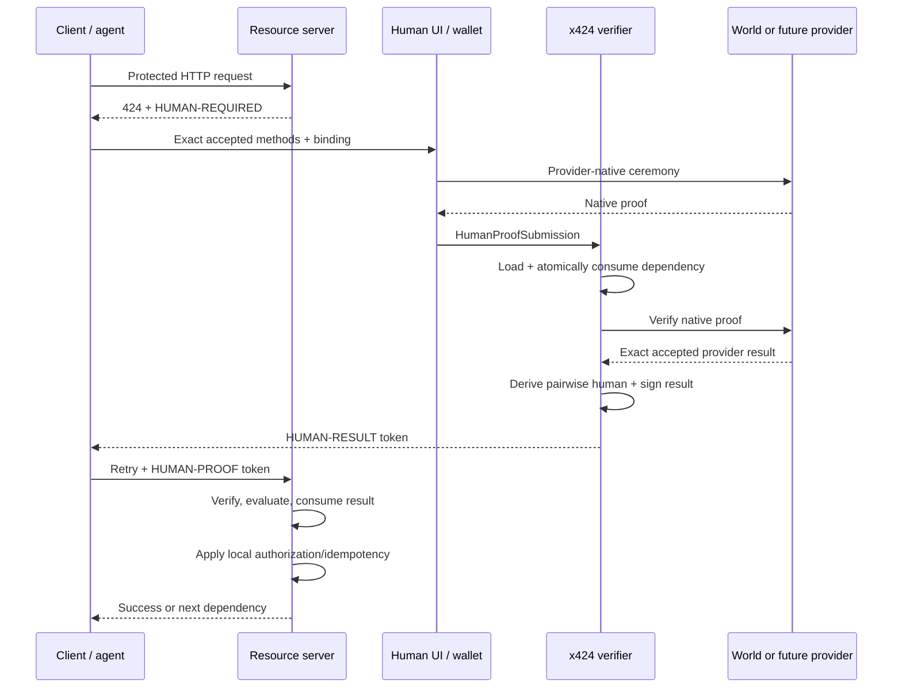

# Architecture

## Objective

x424 is the smallest layer that can answer one question across browsers,
agents, backends, L1s, and L2s:

> Has one explicitly accepted unique human satisfied this exact dependency for
> this exact request and caller?

It separates the provider's native proof, the verifier's execution location,
the resource server's sufficiency policy, and the application's authorization.

## Components

| Component                  | Owns                                                     | Must not own                               |
| -------------------------- | -------------------------------------------------------- | ------------------------------------------ |
| Resource server            | protected request, accepted methods, local authorization | provider secrets or proof reinterpretation |
| x424 client                | challenge handling, provider handoff, retry              | human nullifiers or authority escalation   |
| Human/provider UI          | consent and provider ceremony                            | application authorization                  |
| Provider adapter           | native proof, binding validation, exact claim/scope      | provider equivalence                       |
| x424 verifier              | nonce, provider execution, pairwise ID, signed result    | relying-party business permissions         |
| Result verifier/middleware | signature, exact binding, replay                         | payment, trade, vote, or spend decisions   |
| Application policy         | final allow/deny and business idempotency                | changing what a provider proved            |

## Trust flow

## Deployment shapes

The semantic requirement does not change with execution location:

| Shape     | Provider verification                                        | Result/state                     | Suitable for                                     |
| --------- | ------------------------------------------------------------ | -------------------------------- | ------------------------------------------------ |
| Backend   | provider API or local verifier                               | signed short-lived result        | web/API default                                  |
| Off-chain | local cryptographic verifier                                 | signed result / transparency log | disconnected or privacy-sensitive systems        |
| On-chain  | contract/native verifier                                     | chain receipt/state              | contracts that must decide without backend trust |
| Hybrid    | provider/backend verification plus chain commitment/registry | compound references              | public audit or cross-system continuity          |

These modes are not strength levels. A chain anchor may prove publication but
not live revocation. A backend may provide fresh private status but depend on
one operator. A relying party accepts exact modes per method.

## Chain neutrality

x424 has no canonical chain and no universal human registry. A requirement can
be issued by a backend, an L1/L2 contract gateway, or a chain-aware agent. State
references may use CAIP identifiers. Chain adapters must declare:

- supported verification and state capabilities;
- chain/registry IDs and upgrade authority;
- finality and reorganization behavior;
- revocation/status latency;
- availability and fee behavior; and
- public linkability.

An on-chain implementation MUST preserve the same provider/method/version,
scope, audience/purpose equivalent, caller binding, replay, and non-claim
semantics. “Verified on chain” cannot erase provider distinctions.

## Provider extension model

The core has no `worldNullifier`, biometric, DID, chain, or vendor field.
A provider adapter exposes one or more immutable method descriptors and a
single verification boundary. A future provider can join without changing the
wire objects if it can declare:

- an exact unique-human claim;
- its native uniqueness scope and pseudonym semantics;
- binding and replay behavior;
- lifecycle and recovery behavior;
- privacy and non-claims; and
- one supported verification mode.

The relying party must opt in. Adapter installation is not policy acceptance.

The public adapter SDK validates immutable method descriptors, provider/method
ownership, identifier syntax, duplicates, and catalog alignment before a
verifier starts. Provider-native positive and negative fixtures remain
mandatory because a static adapter shape cannot prove that a provider's
cryptography or operational semantics are correct.

## Portability boundary

x424 portability means the same challenge, result, binding, and retry contract
works across providers and callers. It does not mean one proof can be replayed
across relying parties or that two providers identify the same person.

There is deliberately no cross-provider subject identifier. If a relying party
accepts multiple methods for a one-person policy, it separately owns the rule
that prevents one person from participating once through each provider. That
rule cannot be inferred from adapter installation or pairwise x424 results.

## Agent model

x424 verifies a human dependency for an agent; it does not turn the agent into
a human subject. The first profile binds a result to an agent public-key
fingerprint. This gives machines an interoperable escalation path:

1. detect 424;
2. inspect exact accepted methods;
3. request human completion through a wallet or UI;
4. retry with a scoped result token; and
5. continue through payment or application authorization.

Durable agent ownership, delegation, budgets, and revocation belong in a
separate relationship/authorization system. x424 result tokens may be inputs to
that system but are never bearer mandates.

## State and storage

Minimum verifier state:

- pending dependency ID, nonce, expiry, request digest, binding, and policy;
- provider-private subject/nullifier only within the derivation/uniqueness
  boundary required by that method;
- pairwise-secret key version;
- result signing-key metadata; and
- replay state through result expiry.

Minimum relying-party state:

- trusted verifier keys/configuration;
- accepted immutable method descriptors;
- consumed result IDs for mutations; and
- application authorization/idempotency records.

Raw proofs should be processed in memory and excluded from logs, traces, error
systems, analytics, queues, and public chain state.

## Reference repository boundary

The repository ships a deterministic kernel, provider-adapter SDK, fixed
conformance artifacts, JSON Schemas, and integration surfaces—not a hosted
authority. The Express router uses process-local pending state and is a
reference only. Production deployments replace it with authenticated issuance,
distributed atomic nonce/result stores, managed signing keys, metrics without
proof data, rate limits, and provider-specific operations.
