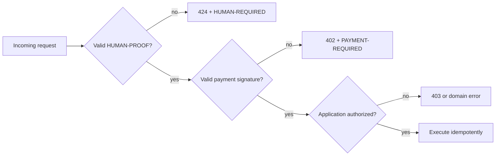

# HTTP, API, MCP, and chain composition

## x424 in the protocol stack

x424 owns only unique-human dependency semantics. It composes with adjacent
protocols instead of duplicating them.

| Layer                   | Question                                            | Typical protocol                     |
| ----------------------- | --------------------------------------------------- | ------------------------------------ |
| Authentication          | Which key/account is calling?                       | TLS/OAuth/OIDC/SIWE/API key          |
| Generic proof           | Which credentials can the caller present?           | x401 + OpenID4VP/DCQL                |
| Unique-human dependency | Did one accepted unique human satisfy this request? | x424                                 |
| Payment                 | Has this request authorized the required payment?   | x402                                 |
| Delegation/mandate      | May this agent act for someone?                     | GNAP/AP2/UCAN/application policy     |
| Authorization           | May this action execute now?                        | AuthZEN or application-native policy |

## x424 before x402

A resource that requires both unique humanity and payment uses deterministic
middleware order:



The first retry satisfies x424 and may receive x402's standard 402 challenge.
The final retry carries both:

```http
HUMAN-PROOF: <x424-result+jws>
PAYMENT-SIGNATURE: <x402-payment-payload>
Idempotency-Key: <application-key>
```

Human proof must be validated before payment settlement if an invalid human
should never be charged. If the application deliberately settles first, that
economic behavior must be explicit. A server must not invent a combined
“human-payment” credential.

## x401

x401 is a generic proof-requirement response over HTTP 401 using credential
presentation standards such as OpenID4VP and DCQL. x424 can accept a provider
adapter that internally uses those standards, but x424 adds the semantics x401
does not by itself guarantee:

- exact unique-human claim;
- explicit uniqueness/pseudonym scope;
- no silent provider equivalence;
- caller/request binding for user and agent flows;
- pairwise result subject;
- provider recovery/rotation implications; and
- result replay semantics for the protected action.

If a route needs a driver's-license attribute and unique-human proof, it may
issue x401 and x424 challenges in a documented order or expose both requirements
through discovery. The credentials remain separate.

## REST and OpenAPI

The reference API exposes requirement creation and provider-proof verification.
The OpenAPI file is [`../openapi/x424.openapi.json`](../openapi/x424.openapi.json).
Production deployments must add authentication/security schemes without
changing the core schemas. Native proof schemas remain opaque because the
provider adapter owns them.

## MCP

The MCP server is an agent integration surface, not a proof custodian. It can:

- create a local requirement object;
- inspect `HUMAN-REQUIRED`;
- evaluate a result against exact semantics; and
- verify a signed result with a trusted public key.

It deliberately does not expose a general “upload World proof” tool. Raw proofs
belong in a trusted verifier/UI channel. An agent receives a short-lived result
bound to its public key and uses `HUMAN-PROOF` on the resource request.

## Browser/UI

The no-build console demonstrates the two API calls and makes the privacy
boundary visible. In production, World IDKit supplies provider-native proof
directly and the relying-party backend supplies signed RP context. No RP key or
provider nullifier belongs in browser storage.

## On-chain resources

Contracts cannot emit an HTTP 424 response. A chain gateway or RPC layer can
translate a contract precondition into x424, or the contract can verify an
on-chain adapter result directly. The equivalent contract rule must bind:

- provider/method/descriptor version;
- accepted uniqueness scope;
- action/contract/chain domain;
- caller/account or agent key;
- replay/nullifier state; and
- expiry/finality rules where meaningful.

L1, L2, backend, and off-chain profiles can coexist, but each must be named in
the method requirement. “On chain” never becomes a provider-independent human
claim.
