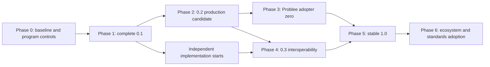

# x424 production, adoption, and standards execution plan

> Status: program baseline (repository-controlled artifacts in `docs/program/`)  
> Last updated: 2026-07-19  
> Scope: current public pre-alpha through stable 1.0 and ecosystem expansion  
> First adopter: Problee, operating only through public x424 surfaces  
> Tracking: [program/DELIVERABLE_REGISTER.md](program/DELIVERABLE_REGISTER.md)

## 1. Purpose

This document turns the release stages in [ROADMAP.md](ROADMAP.md) into an
executable program of work. The objective is to make a unique-human dependency
a configuration choice for HTTP resources, clients, and agents:

> One request may execute only after one explicitly accepted unique human has
> satisfied that exact dependency for that exact request and caller.

x424 succeeds when an adopter can impose that condition without designing its
own challenge format, provider handoff, proof-submission flow, request binding,
privacy boundary, replay system, result token, or retry behavior.

Problee is adopter zero and the first production proof of the public adopter
contract. It receives no private fields, privileged methods, hidden claims,
custom verifier behavior, or compatibility exceptions. Work exposed by Problee
must be classified and shipped in the correct public layer before Problee can
depend on it.

This is an execution document, not a normative protocol artifact. If it
conflicts with another document, authority remains:

1. [PROTOCOL.md](PROTOCOL.md) for normative protocol behavior;
2. the published schemas and conformance vectors;
3. [GOVERNANCE.md](GOVERNANCE.md) for change control and stable-release gates;
4. [SECURITY.md](SECURITY.md) for security invariants and production controls;
5. [ADOPTER_CONTRACT.md](ADOPTER_CONTRACT.md) for the adopter boundary; and
6. [ROADMAP.md](ROADMAP.md) for release-stage definitions.

## 2. Product boundary

### 2.1 x424 owns

- `424 Failed Dependency` detection and `HUMAN-REQUIRED` transport;
- exact provider, method, descriptor, scope, assurance, and mode acceptance;
- request, audience, purpose, caller, nonce, and time binding;
- trusted provider request construction;
- provider-native proof handoff to the selected verifier adapter;
- private provider-subject handling and pairwise result derivation;
- provider-subject, dependency, and result replay controls;
- signed, short-lived `HUMAN-RESULT` and `HUMAN-PROOF` tokens;
- one-challenge/one-resolution client behavior and safe retry semantics;
- provider-adapter contracts and conformance requirements;
- public middleware, verifier interfaces, schemas, examples, and test kits; and
- interoperability evidence across independently operated components.

### 2.2 x424 does not own

- the provider's underlying proof of humanity or uniqueness;
- a universal human identifier or cross-provider identity graph;
- accounts, identity lifecycle, authorization, reputation, KYC, or delegation;
- cross-provider duplicate-participation policy;
- an identity wallet, biometric system, credential format, or trust registry;
- payment settlement or a combined human-payment credential;
- a canonical blockchain, token, verifier service, or hosted operator;
- Problee markets, trading, voting, governance, wallets, or permissions; or
- application recovery, business idempotency, and final allow/deny decisions.

x424 guarantees that an accepted dependency and mutation result are consumed
according to their declared single-use policy. It does not guarantee exactly-once
business execution across the verifier, resource server, database, chain, or
another side-effecting system. Mutations still require adopter-owned
idempotency, transaction, or outbox behavior and an at-least-once retry model.

### 2.3 Non-negotiable engineering rules

1. **Public-surface rule:** adopter zero uses released public packages and
   documented interfaces only.
2. **Exact-claim rule:** a provider result is never strengthened, normalized
   into a generic score, or treated as equivalent to another method.
3. **No hidden fallback:** an outage or unsupported proof fails closed; it does
   not silently activate another provider, method, or verification mode.
4. **No second human namespace:** adopting x424 must not accidentally create a
   second accepted identity for an existing human population.
5. **Privacy boundary:** raw proofs and stable provider subjects never enter
   logs, traces, analytics, queues, public results, or application databases.
6. **Conformance before convenience:** changes to portable behavior require
   positive and negative vectors before adopter code depends on them.
7. **Security before value:** no pre-production reference component protects
   valuable production actions.
8. **Evidence before standards claims:** x424 earns standard status through
   independent implementation and adoption, not naming or marketing.

## 3. Program definition of done

The program is complete only when all four outcomes below are true.

### 3.1 Production-ready

- A reviewed deployment can protect production access and value without
  undocumented application glue.
- Requirement issuance is authenticated and authorized.
- State is durable, distributed, atomic, monitored, backed up, and tested under
  concurrency, restart, partial outage, and recovery.
- Result-signing and pairwise-derivation keys use managed custody, independent
  rotation, validity periods, overlap, and revocation.
- Verifier metadata and trusted keys are authenticated and discoverable.
- Rate limits, abuse controls, proof-safe telemetry, alerts, and runbooks exist.
- Fuzzing, dependency review, load testing, failure injection, and independent
  security/privacy review have zero Critical and no unaccepted High finding
  under the Phase 0 severity policy.

### 3.2 Adopter-ready

- A competent unrelated team can protect an endpoint with a supported provider
  in one working day without cryptographic or wire-protocol code.
- Browser, REST, SDK, OpenAPI, and agent clients can satisfy the same endpoint.
- The adopter supplies only provider configuration, exact method policy,
  authenticated binding extraction, provider UI, and application policy.
- The adopter deletes more custom human-verification machinery than it adds.
- A local test environment can exercise every failure path without real proof
  data or production provider credentials.

### 3.3 Interoperable

- An independently built client can satisfy an independently operated resource
  server and verifier.
- At least one non-TypeScript implementation passes all normative vectors.
- At least two provider profiles with materially different trust models retain
  their exact claims through the same wire contract.
- At least two production relying parties unrelated to the x424 and Problee
  maintainers use only public protocol surfaces.
- A public compatibility matrix records every supported component combination.

### 3.4 Standards-credible

- Canonicalization, signatures, metadata, version negotiation, extensions,
  migration, rotation, and revocation are formally specified.
- Public security and privacy findings are resolved or explicitly accepted.
- Namespace and change governance are neutral and independently testable.
- No adopter, provider, chain, verifier, or package is required for conformance.
- A suitable neutral standards venue has been evaluated with independent
  adopters, providers, implementers, and security reviewers.

## 4. Delivery model

### 4.1 Workstreams

| Workstream               | Scope                                                              | Primary evidence                    |
| ------------------------ | ------------------------------------------------------------------ | ----------------------------------- |
| Protocol                 | transport, canonicalization, binding, replay, metadata, versioning | normative text, schemas, vectors    |
| Reference implementation | core, clients, middleware, verifier, adapters                      | released packages and tests         |
| Runtime and operations   | durable state, key custody, images, telemetry, runbooks            | deployment profiles and drills      |
| Provider profiles        | exact provider ceremony, validation, privacy, lifecycle            | provider fixtures and profile tests |
| Developer experience     | quickstarts, examples, local harness, diagnostics                  | time-to-first-protected-endpoint    |
| Conformance              | black-box role suites and compatibility matrix                     | independently reproducible results  |
| Adoption                 | Problee and unrelated relying parties                              | public-surface acceptance evidence  |
| Governance and standards | namespaces, change control, IPR, neutral process                   | public decisions and release gates  |

### 4.2 Phase dependency map

Durations below are planning ranges, not release promises. External audits,
provider reviews, independent implementations, and unrelated adoption can
extend the calendar even when engineering work is complete.

| Phase                    |                   Planning range | Depends on                             | Release/evidence outcome           |
| ------------------------ | -------------------------------: | -------------------------------------- | ---------------------------------- |
| 0. Baseline and controls |                           1 week | current branch                         | approved execution baseline        |
| 1. Developer preview     |                        2-4 weeks | Phase 0                                | released and reviewed 0.1          |
| 2. Production candidate  |                       6-10 weeks | Phase 1                                | production-shaped 0.2              |
| 3. Problee adopter zero  |                        4-8 weeks | 0.2 release candidate                  | public-surface production adoption |
| 4. Interoperability      |                       8-16 weeks | 4A starts in Phase 1; 4B needs Phase 2 | 0.3 compatibility evidence         |
| 5. Stable protocol       | 6-10 weeks after evidence exists | Phases 3-4                             | 1.0                                |
| 6. Ecosystem expansion   |                          ongoing | 1.0                                    | broad independent adoption         |

The nominal engineering path is approximately 23-41 weeks through a 1.0
release candidate. It is not a calendar commitment: audit procurement,
independent implementation, provider participation, and unrelated production
adoption have external lead times and can dominate the critical path. Those
commitments begin in Phase 0 rather than waiting for Problee to finish.

### 4.3 Gate vocabulary

Subjective language does not pass a release gate. Unless a versioned deployment
profile sets a stricter rule, the program uses these definitions:

- **Fresh unrelated team:** at least three engineers who have not contributed
  to x424 or received private implementation guidance. At least two must finish
  the prescribed task using only released public artifacts.
- **One working day:** no more than eight working hours per successful engineer,
  measured from an empty project through a passing protected-endpoint test.
- **Representative environment:** the versioned compatibility matrix approved
  in Phase 0, containing named browser, server, edge, proxy, gateway, and agent
  versions. “Works locally” is not representative.
- **Conservative transport limit:** a documented limit that passes every
  required intermediary profile with the approved safety margin and fails
  closed above that limit.
- **Reproducible artifact:** a clean build from the signed tag produces the
  declared file manifest and checksums, or a documented nondeterministic field
  is excluded by the reproducibility profile.
- **No undocumented glue:** the adopter implements only the five responsibilities
  in `ADOPTER_CONTRACT.md`; any cryptographic, wire, proof-parsing, nullifier,
  token, or replay code outside public x424 components fails the gate.
- **Approved parity:** 100% of security-sensitive decisions match; every other
  mismatch is classified, reviewed, and explicitly accepted before enforcement.
- **Meaningful Problee action:** a recurring production action used by real
  non-administrative users or agents, with monitored availability and rollback;
  demos and staff-only endpoints do not qualify.
- **Materially different provider:** an independent reviewer confirms a
  different root of trust plus a materially different proof, uniqueness,
  recovery, or lifecycle model; a wrapper around the same provider does not count.
- **Independent review:** the reviewer did not author the reviewed component,
  does not report to the component owner for the engagement, and publishes a
  scope, method, findings, and disposition.
- **All vectors pass:** every normative requirement ID mapped to an executable
  vector passes for the claimed role and version; unmapped normative behavior
  is a release blocker, not an implicit pass.

Every gate records the environment/profile version, artifact identifiers,
test results, finding disposition, approving roles, and evidence URLs in the
deliverable register.

## 5. Phase 0 — Baseline and program controls

**Objective:** establish one truthful baseline, turn the roadmap into owned
work, and prevent adopter urgency from bypassing protocol governance.

### 5.1 Program setup

- [x] Approve this execution plan as the program baseline.
- [ ] Create one tracked epic for every stable deliverable ID in Appendix B;
      use the detailed checkboxes as subtasks rather than disconnected issues.
      (Blocked on GitHub write authorization; in-repo register is
      `program/DELIVERABLE_REGISTER.md`.)
- [ ] Label each issue by phase, workstream, priority, compatibility impact,
      security impact, and required release gate.
- [ ] Assign a directly responsible owner and reviewer to every P0/P1 issue.
- [x] Record dependencies, external blockers, and required evidence on issues.
      (Recorded in `program/DELIVERABLE_REGISTER.md` and
      `program/EXTERNAL_ENGAGEMENTS.md`.)
- [ ] Establish a weekly release-gate review covering security, compatibility,
      adopter pressure, and external dependencies.
- [x] Require protocol changes to use the public protocol-change template.
- [x] Require provider changes to use the provider-profile template.
- [ ] Secure funded commitments or named recruitment owners for the external
      design review, production audit, independent implementation, second
      provider, independent verifier, and unrelated adopters.
      (Engagement packages ready; counterparties not contracted.)
- [x] Publish a conflict-of-interest policy: the Problee adoption lead recuses
      from approving the classification and release gate of portable changes
      requested by Problee.
- [x] Require two-party approval for portable protocol changes: one protocol
      reviewer and one independent security/interoperability reviewer.
- [x] Publish decision records and provide a documented appeal path for disputed
      layer classification or conformance interpretation.

### 5.2 Current-state evidence

- [x] Record the current package version, commit, CI result, test inventory,
      schema versions, vector count, provider profiles, and public examples.
      See `program/BASELINE_EVIDENCE.md`.
- [x] Map every item in `ROADMAP.md` to implementation and evidence status.
      (Via deliverable register + roadmap links to this plan.)
- [x] Map every production limitation in `SECURITY.md` to a blocking issue.
      (Mapped to P2-* deliverables in the register; GitHub issues pending auth.)
- [x] Produce a component maturity table: demonstrative, developer-ready,
      production-candidate, reviewed, or independently interoperable.
- [x] Identify all public APIs not yet covered by compatibility tests.
- [ ] Establish baseline time for a fresh developer to protect one endpoint.
- [ ] Establish baseline package size, install time, client bundle impact, and
      verifier latency excluding the human ceremony.
- [x] Publish role, trust-boundary, and sensitive-data-flow diagrams covering
      issuer, client, provider UI, verifier, provider, resource server, state,
      key systems, and operator access.

### 5.3 Decision control

- [x] Adopt the classification test in Section 12 for all Problee-discovered
      gaps before any code is written.
- [x] Document the release authority for 0.1, 0.2, 0.3, and 1.0.
- [x] Define the evidence required to mark a checklist item complete.
- [x] Define the emergency process for security fixes without weakening
      versioning, privacy, or exact-method acceptance.
- [x] Approve a severity rubric and exception policy. Critical findings may not
      be accepted for production. High findings require independent approval,
      a named owner, compensating controls, an expiry date, and a release-blocking
      remediation milestone.
- [x] Approve versioned deployment profiles with numeric availability, latency,
      throughput, concurrency, capacity, clock-skew, RTO, RPO, backup, and
      recovery targets. Later gates reference a named profile, not an undefined
      "agreed SLO."
- [x] Assign stable requirement IDs to every normative MUST/SHOULD and map each
      one to positive, negative, or documented non-testable evidence.

### Phase 0 exit gate

- Every roadmap and security item has an owner, issue, priority, dependency,
  and objective completion artifact.
- No unresolved P0 ambiguity exists about x424's product boundary.
- Problee work cannot enter x424 without public classification and review.
- External review, implementation, provider, verifier, and adopter commitments
  have a funded owner, target milestone, and lead-time risk in Appendix B.

## 6. Phase 1 — Complete the 0.1 developer preview

**Objective:** publish a coherent, externally reviewable developer release and
resolve transport questions that would otherwise block multiple implementations.

### 6.1 Protocol transport and request semantics

- [x] Complete an early HTTP standards review covering RFC 4918 status 424,
      HTTP field syntax/Structured Fields, Problem Details, Content-Digest,
      caching, redirects, CORS, field/media registration, and potential IANA
      considerations. Record where x424 extends rather than conforms to WebDAV.
      (ADR-0001; full IANA registration deferred.)
- [ ] Test `424`, `HUMAN-REQUIRED`, `HUMAN-PROOF`, `HUMAN-RESULT`, caching, and
      `Vary` behavior across representative browsers, Node runtimes, Cloudflare,
      nginx, Envoy, API gateways, serverless platforms, and common HTTP clients.
- [x] Measure real intermediary header limits. Select a conservative inline
      requirement envelope limit from evidence rather than the reference maximum.
      (8 KiB interop envelope selected; empirical intermediary lab still open.)
- [x] If inline requirements cannot be reliably transported, design a versioned
      body or reference-URL transport without weakening integrity, privacy, expiry,
      or cache rules.
- [x] Define CORS requirements, including exposed headers, allowed origins,
      credential behavior, preflight, and CSRF controls.
- [x] Define redirect behavior. Challenges and proofs must not be forwarded to
      an unintended origin or audience.
- [x] Define behavior for binary bodies, form data, multipart uploads, empty
      bodies, large JSON, duplicate keys, unsupported numeric values, and streams.
- [x] Evaluate an existing HTTP content-digest standard before inventing a new
      non-JSON digest profile. (ADR-0002 prefers RFC 9530 alignment for opaque.)
- [x] Define client behavior for non-cloneable and non-replayable requests.
- [x] Define idempotency requirements for mutations and lost success responses.
- [ ] Define stable error codes and retryability without exposing provider
      diagnostics or enabling proof probing. (Partial; expand vectors.)
- [ ] Add positive and negative vectors for every resulting decision.

### 6.2 Canonicalization and wire contract

- [ ] Expand canonical encoding vectors to nested objects, Unicode, escaped
      characters, numeric boundaries, invalid values, and field-order variation.
- [ ] Freeze the exact byte inputs for request digests and result signatures.
- [ ] Publish an interoperability-candidate canonicalization profile before an
      independent implementation starts. Phase 5 may ratify or version it but
      must not silently reinterpret the same protocol version.
- [ ] Cross-check schemas, OpenAPI, normative text, and TypeScript parsing so an
      inconsistency cannot create a more-permissive interpretation.
- [ ] Add schema compatibility tests that reject additional, ambiguous, stale,
      or silently coerced fields.
- [ ] Document which 0.1 decisions are provisional before formal 1.0
      canonicalization and how a versioned correction would migrate.
- [ ] Define initial protocol-version negotiation, unknown critical-extension
      behavior, provider namespace ownership, algorithm allowlisting, and
      downgrade protection early enough for independent implementations.
- [ ] Publish initial neutral change, namespace, and implementation-rights rules;
      Phase 5 will ratify proven governance rather than introduce it after interop.

### 6.3 World browser-to-resource reference flow

- [ ] Build a complete browser example using only exported package APIs.
- [ ] Generate the World relying-party request only on the trusted backend.
- [ ] Display or deep-link the connector URI without exposing signing material.
- [ ] Forward the exact IDKit result to the verifier without reshaping.
- [ ] Verify current Proof of Human with legacy disabled by default.
- [ ] Demonstrate explicit legacy enablement as a separate method branch.
- [ ] Bind the proof to a real authenticated wallet, session, or agent-key test
      subject rather than an untrusted client string.
- [ ] Demonstrate wrong binding, expiry, replay, provider outage, and verifier
      rejection in local fixtures.
- [ ] Demonstrate one automatic challenge resolution and retry with no second
      human gesture.
- [ ] Confirm raw proofs and nullifiers never enter browser persistence, logs,
      analytics, or resource-server state.

### 6.4 Package and release readiness

- [ ] Publish the first npm release with provenance from the tagged workflow.
- [ ] Smoke-test every documented export from the packed artifact, not source.
- [ ] Add an installation test in an empty project using supported Node/pnpm
      versions.
- [ ] Verify tree-shaking and prevent server-only code, provider secrets, Redis,
      Express, or MCP dependencies from entering browser bundles accidentally.
- [ ] Decide package topology before 0.2: keep a monorelease only if core and
      browser consumers can avoid installing and resolving provider, Redis,
      Express, MCP, and Node-only code; otherwise split versioned packages.
- [ ] Test core and client surfaces against the named Node, browser, worker/edge,
      ESM, bundler, and framework profiles. Avoid Node built-ins on portable
      surfaces unless an explicit runtime profile permits them.
- [ ] Establish semver, protocol-version, method-descriptor-version, and schema
      compatibility rules.
- [ ] Publish release notes containing security, privacy, wire, and migration
      impact.
- [ ] Document supported runtimes and the maintenance window for each release.

### 6.5 Developer experience

- [ ] Create a quickstart that protects one endpoint in under 30 minutes.
- [ ] Separate self-hosted verifier, managed-verifier-compatible, browser,
      server, and agent paths clearly.
- [ ] Provide copyable configuration with placeholders that cannot be mistaken
      for production secrets.
- [ ] Provide a local fake provider and deterministic proof fixtures.
- [ ] Provide troubleshooting for proxy headers, CORS, binding mismatch, clock
      skew, replay, action scope, and World environment mismatch.
- [ ] Measure setup time with at least three developers who did not author x424.
- [ ] Fix all issues that force those developers to read implementation source.

### 6.6 External review

- [ ] Complete the Phase 1 design review of the 0.1 HTTP semantics, wire contract,
      canonicalization candidate, cryptographic construction, and threat model.
- [ ] Publish non-sensitive findings and maintainer responses.
- [ ] Resolve every critical finding before tagging 0.1.
- [ ] Convert every corrected ambiguity into a conformance vector.

The Phase 1 review is distinct from the Phase 2 implementation/deployment
assessment and the Phase 5 release-candidate delta review. Findings remain
linked across stages so repeated review does not become duplicated ceremony.

### Phase 1 exit gate

- A fresh external developer can run the complete browser and agent flows from
  public documentation and identify every non-production component.
- The npm package is reproducible, provenance-signed, and smoke-tested.
- Transport, retry, body-digest, and CORS limitations are explicit and tested.
- The 0.1 contract has an external review with zero Critical finding and every
  High finding closed or assigned a time-bounded disposition under Phase 0 policy.

## 7. Phase 2 — Build the 0.2 production candidate

**Objective:** make self-hosting operationally complete and safe enough for an
independently reviewed production deployment.

### 7.1 Production verifier distribution

- [ ] Ship a versioned, minimal, non-root verifier container image.
- [ ] Pin and scan base images and runtime dependencies.
- [ ] Expose separate liveness, readiness, and dependency health signals.
- [ ] Validate all configuration before accepting traffic.
- [ ] Support graceful shutdown without losing accepted requirements or issuing
      results after state becomes unavailable.
- [ ] Separate requirement issuance, provider verification, and public health
      routes so operators can apply different network and authorization policies.
- [ ] Provide Docker Compose for evaluation and a production deployment profile
      for at least one common orchestrator.
- [ ] Generate an SBOM and signed release artifacts.

### 7.2 Authenticated issuance and verifier trust

- [ ] Define an authentication interface for requirement issuance.
- [ ] Ship at least one production profile using established service identity
      such as OAuth client credentials, signed JWTs, or mTLS.
- [ ] Authorize issuer, audience, accepted methods, purposes, and resource URI
      patterns independently; authentication alone must not grant arbitrary issuance.
- [ ] Prevent clients from supplying provider origins, signing keys, verifier
      keys, or method descriptors outside trusted server configuration.
- [ ] Define the production integrity profile for requirements, including when
      a signed outer requirement is mandatory because resource server and
      verifier are separate authorities.
- [ ] Define authenticated verifier metadata containing protocol versions,
      endpoints, supported exact methods, signing keys, key validity, and status.
- [ ] Evaluate established federation/discovery mechanisms before assigning a
      permanent well-known route; `/.well-known/x424` is a candidate, not a foregone
      protocol decision.
- [ ] Define metadata caching, rollover, revocation, pinning, and outage rules.
- [ ] Threat-model malicious or compromised issuers, verifiers, providers,
      metadata publishers, administrators, and tenant operators rather than
      assuming every trusted role is honest.
- [ ] Require resource servers to trust configured issuers and keys; never trust
      a key presented alongside its own result.

### 7.3 Key custody and rotation

- [ ] Define independent interfaces for result signing and pairwise derivation.
- [ ] Implement KMS/HSM-compatible signing without exporting private key material.
- [ ] Keep result-signing and pairwise-HMAC keys separate by role and policy.
- [ ] Add key IDs, validity intervals, activation, retirement, and revocation.
- [ ] Implement overlapping result-key rotation and verify old unexpired results
      through the declared overlap period.
- [ ] Design pairwise-secret rotation as an identity migration, including
      versioned namespaces, collision checks, overlap, cutover, and rollback.
- [ ] Test interrupted rotation and multi-instance skew.
- [ ] Document emergency compromise response and maximum exposure windows.

### 7.4 Durable state profiles

- [ ] Harden Redis key names, TTLs, atomic scripts, connection handling,
      clustering, failover, multi-tenancy boundaries, and memory behavior.
- [ ] Add a PostgreSQL profile with transactional requirement, dependency,
      provider-subject, and result-replay consumption.
- [ ] Define storage interfaces that preserve identical atomic semantics across
      implementations.
- [ ] Test concurrent duplicate proof submission and result consumption across
      multiple verifier and resource-server instances.
- [ ] Test process crash before and after each external-provider call and state
      transition.
- [ ] Test Redis failover, PostgreSQL failover, timeouts, network partitions,
      partial writes, stale replicas, backup, restore, and disaster recovery.
- [ ] Define single-region and multi-region consistency profiles. A deployment
      may not claim cross-region replay safety without passing the corresponding
      partition and stale-read tests.
- [ ] Encrypt state and backups in transit and at rest; document data residency,
      tenant isolation, key ownership, restore access, RTO, and RPO.
- [ ] Document retention, erasure, backup, and privacy impact without implying
      that local deletion resets provider eligibility.
- [ ] Provide capacity guidance and state cardinality estimates.

### 7.5 Maintained resource middleware

- [ ] Ship maintained Express middleware for challenge issuance and proof
      acceptance instead of requiring adopters to assemble router internals.
- [ ] Ship generic Fetch middleware for edge, serverless, and framework adapters.
- [ ] Expose policy configuration by exact purpose, route, method, binding,
      accepted provider method, freshness, scope, and result-consumption rule.
- [ ] Require an authenticated binding extractor and prevent untrusted request
      JSON from becoming an accepted binding.
- [ ] Support declared safe-read, single-use mutation-authorization, and batch
      policies without conflating replay semantics. Middleware must require or
      expose adopter idempotency/transaction hooks; it must not claim exactly-once
      business effects.
- [ ] Compose deterministically with authentication, x401, x402, authorization,
      and application execution.
- [ ] Test middleware ordering and ensure an invalid human is not charged when
      x424 is configured before x402.

### 7.6 Operational controls

- [ ] Add configurable limits for header/body size, pending requirements,
      attempts, proof age, timeouts, and concurrent provider calls.
- [ ] Rate-limit issuance and proof submission independently by issuer, caller,
      method, IP/network signal, and deployment risk policy.
- [ ] Add circuit breakers and bounded retries for provider calls without
      replaying consumed dependencies or activating fallback methods.
- [ ] Use fixed provider egress allowlists and reject client-supplied URLs to
      prevent SSRF and verifier-origin confusion.
- [ ] Emit proof-safe metrics for issuance, completion, rejection reason class,
      latency, replay attempts, state failure, provider outage, and key status.
- [ ] Add structured logs that exclude raw proofs, provider subjects, signals,
      secrets, and derivation inputs by construction.
- [ ] Provide trace hooks that record opaque correlation IDs only.
- [ ] Define SLOs and alerts for verifier availability, state availability,
      provider verification latency, replay-store failure, and key expiry.
- [ ] Create operator dashboards and synthetic probes using fake proof data.
- [ ] Define a trusted time-source and clock-skew policy; alert before clock or
      metadata drift can alter acceptance.
- [ ] Complete a privacy/data-protection assessment covering operator and adopter
      roles, controller/processor responsibilities, purpose limitation,
      retention, erasure, data residency, subprocessors, and incident notice.

### 7.7 Security verification

- [ ] Add parser and canonicalization fuzzing.
- [ ] Add property tests for binding, scope, time, method, audience, and replay.
- [ ] Add differential tests between schemas, validators, and token verification.
- [ ] Add load and soak tests with realistic concurrency and state cardinality.
- [ ] Add failure injection around storage, provider calls, clocks, key rotation,
      process termination, and network partitions.
- [ ] Test result theft and TOCTOU, request smuggling, cache poisoning, SSRF,
      proof oracles, algorithm confusion, malicious metadata, decompression/body
      bombs, tenant crossover, and privileged-operator abuse.
- [ ] Review dependency and build-chain security; enforce pinned CI actions and
      provenance for packages and images.
- [ ] Commission independent protocol, implementation, privacy, and deployment
      review.
- [ ] Publish non-sensitive findings, affected versions, and resolutions.
- [ ] Establish vulnerability disclosure, advisory/CVE assignment, supported
      version, security-contact, and bug-bounty or funded-research processes.
- [ ] Define provider-compromise, emergency method disablement, profile
      withdrawal, and adopter notification behavior without silently switching
      affected users to another method.

### 7.8 Runbooks

- [ ] Provider outage and degraded-latency runbook.
- [ ] Result-signing key compromise and rotation runbook.
- [ ] Pairwise-secret compromise/migration runbook.
- [ ] Redis/PostgreSQL outage, corruption, restore, and reconciliation runbook.
- [ ] Clock skew and expired metadata runbook.
- [ ] Proof or provider-subject leakage incident runbook.
- [ ] Bad release rollback and compatibility runbook.
- [ ] Abuse spike and denial-of-service runbook.
- [ ] Provider compromise/profile withdrawal and adopter communication runbook.
- [ ] On-call escalation, public status, customer/adopter notification, and
      post-incident review runbook.

### Phase 2 exit gate

- A deployment passing a named numeric profile protects an endpoint with no
  undocumented security, state, key, middleware, or operational glue.
- Multi-instance concurrency, load, capacity, failure, recovery, rotation,
  outage, RTO, and RPO tests meet that profile's thresholds.
- Independent implementation/deployment review has zero Critical findings and
  no unaccepted High finding under the Phase 0 exception policy.
- The reference router and in-memory stores remain clearly development-only.
- A tagged 0.2 release includes packages, verifier image, SBOM, deployment
  profile, runbooks, compatibility notes, and rollback instructions.

## 8. Phase 3 — Problee adopter zero

**Objective:** prove that a real agent-native protocol can adopt x424 entirely
through public surfaces without turning Problee into the protocol definition.

This phase may begin against a 0.2 release candidate, but no valuable Problee
action cuts over before the Phase 2 security gate passes.

### 8.1 Adopter contract

- [ ] Write a Problee capability matrix describing required human-dependency
      semantics without referencing private implementation details in x424.
- [ ] Identify the existing provider method, uniqueness action/scope, binding,
      recovery semantics, durable application projection, and protected actions.
- [ ] Preserve the existing accepted human namespace and document any migration
      mapping; do not mint a second local human identity merely to adopt x424.
- [ ] Initially accept one exact method: `world:proof-of-human@1`.
- [ ] Keep legacy World proofs disabled unless a separately reviewed application
      policy explicitly requires the distinct legacy method and deduplication plan.
- [ ] Bind every result to an already authenticated wallet, session, request, or
      agent key using a server-trusted extractor.
- [ ] Keep membership, voting eligibility, market permissions, authorization,
      and idempotency in Problee.
- [ ] Consume only versioned public x424 packages and documented configuration.
- [ ] Prohibit source imports, repository-relative imports, private package
      builds, hidden endpoints, and Problee-only fields.

### 8.2 Gap classification

For every blocker discovered by Problee:

- [ ] State the required behavior without naming Problee.
- [ ] Apply the classification test in Section 12.
- [ ] If portable, change x424 core publicly with normative impact analysis and
      negative vectors before Problee uses it.
- [ ] If World-native, change the World profile with provider fixtures and exact
      claim/non-claim review.
- [ ] If operational, change a public runtime package or deployment profile.
- [ ] If product policy, keep it in Problee and do not generalize it into x424.
- [ ] Record rejected special cases so they do not reappear under new names.

### 8.3 Observation-only integration

- [ ] Integrate x424 beside the current decision path without changing outcomes.
- [ ] Compare allow/deny outcomes and reason classes without logging raw proofs,
      nullifiers, stable provider subjects, or pairwise derivation inputs.
- [ ] Verify that existing verified users do not receive duplicate local
      identities or unexpected re-enrollment requirements.
- [ ] Measure challenge frequency, completion, error class, latency, abandonment,
      provider outages, state consumption, and retry behavior using privacy-safe data.
- [ ] Investigate every mismatch and classify it as a bug, intended semantic
      difference, migration issue, or invalid legacy behavior.
- [ ] Reach an approved parity threshold with no unexplained security-sensitive
      mismatch before enforcing x424.

### 8.4 Low-risk enforcement

- [ ] Select one reversible, non-financial, non-governance endpoint.
- [ ] Protect the same endpoint for browser, REST, SDK, and agent clients.
- [ ] Confirm the human completes only the accepted World ceremony; the x424
      challenge, verification, result issuance, and retry remain automatic.
- [ ] Test wrong request, wrong wallet/session, wrong purpose, wrong audience,
      wrong method, expiry, replay, duplicate execution, and provider outage.
- [ ] Verify failure is closed for the protected action and does not activate a
      second method.
- [ ] Exercise operational rollback to the previous application path without
      presenting users with an alternative verification method.

### 8.5 Progressive production rollout

- [ ] Define canary cohorts and objective rollback thresholds.
- [ ] Progress through observation, internal users, small canary, broader canary,
      and full enforcement.
- [ ] Run provider outage, storage outage, key rotation, verifier restart, and
      partial-network failure drills before each material expansion.
- [ ] Require security and application-owner signoff before protecting trading,
      voting, governance, settlement, or other valuable actions.
- [ ] Delete superseded custom challenge, proof-forwarding, replay, token, and
      retry code once rollback and retention windows expire.
- [ ] Retain only Problee authorization, identity projection, business
      idempotency, and explicitly application-owned migration policy.

### 8.6 Problee acceptance evidence

- [ ] Problee uses released public packages with a reproducible lockfile.
- [ ] No Problee-specific branch or conditional exists in x424.
- [ ] Raw provider proof enters only the designated verifier intake, is processed
      inside that trust boundary, and never leaves it; provider nullifiers remain
      inside the adapter/verifier boundary.
- [ ] No extra human gesture is added beyond the accepted provider ceremony.
- [ ] Browser and agent clients satisfy the same protected resource contract.
- [ ] Verifier replacement does not change the Problee resource contract.
- [ ] Custom verification machinery deleted exceeds x424 integration code added.
- [ ] Production reliability, latency, capacity, RTO, and RPO meet the named
      deployment profile approved at the release gate.
- [ ] A public, non-sensitive adoption report documents public APIs used,
      integration time, deleted glue, failures tested, and protocol gaps found.

### Phase 3 exit gate

- At least one meaningful Problee production action is protected by x424.
- Problee passes every adopter-contract acceptance test through released public
  surfaces.
- No protocol field or behavior is specific to Problee.
- The public adoption report is reproducible by a second adopter.

Problee is evidence of deployability but does **not** count as one of the two
unrelated relying parties required for stable 1.0 because ownership and product
leadership overlap.

## 9. Phase 4 — Prove 0.3 interoperability

**Objective:** prove that x424 is a protocol rather than one TypeScript package,
one World integration, one verifier, or one adopter family.

Phase 4 has two tracks. Phase 4A recruitment, funding, and specification review
starts during Phase 1 because external lead time is part of the critical path.
Phase 4B production interoperability and adoption require the Phase 2 runtime.

### 9.1 Phase 4A — Mobilize independent participants

- [ ] Contract or fund an independent implementation team with a named technical
      lead, language, scope, acceptance terms, and delivery milestones.
- [ ] Secure a candidate second provider and obtain technical/security review
      participation without promising protocol inclusion.
- [ ] Recruit an independent verifier operator and at least two unrelated adopter
      candidates before the 0.2 release candidate.
- [ ] Give independent parties only public specifications, schemas, vectors,
      releases, and issue channels; record any private clarification as a public
      documentation or conformance defect.
- [ ] Schedule design checkpoints against the Phase 1 canonicalization,
      versioning, metadata, and namespace profile before code diverges.
- [ ] Track procurement, legal, provider, security, and deployment lead times in
      Appendix B and escalate when they threaten the 1.0 critical path.

### 9.2 Role-specific black-box conformance

- [ ] Separate conformance suites for requirement issuer/resource server,
      client, verifier, result middleware, state store, and provider adapter.
- [ ] Publish a machine-readable manifest of normative tests and protocol
      versions.
- [ ] Build an `x424 conformance` CLI that tests remote or local components
      without implementation-specific imports.
- [ ] Include fixed positive vectors, negative vectors, malformed inputs,
      timing boundaries, replay races, key rollover, metadata, and transport tests.
- [ ] Require provider-native positive and negative fixtures in addition to
      core conformance.
- [ ] Sign conformance artifacts and publish their source and version.
- [ ] Make a conformance badge link to reproducible evidence rather than a
      maintainer assertion.

### 9.3 Independent implementation

- [ ] Fund or recruit an independent team to implement the protocol in Go,
      Rust, Java, or another ecosystem relevant to servers and agents.
- [ ] Give the team only public specifications, schemas, vectors, and issue
      channels—not private guidance or copied reference internals.
- [ ] Require byte-for-byte canonical, digest, and signature compatibility.
- [ ] Publish every mismatch as a protocol ambiguity, implementation defect, or
      missing vector.
- [ ] Correct the normative artifact first when the reference implementation
      and prose disagree.
- [ ] Demonstrate mixed-stack flows in both directions.

### 9.4 Second provider profile

- [ ] Select a provider with a materially different trust, proof, recovery, and
      uniqueness model—not a cosmetic wrapper around World.
- [ ] Document operator ownership, exact claim, mandatory non-claims, uniqueness
      scope, binding, replay, privacy, lifecycle, recovery, verification mode, and
      outage behavior.
- [ ] Confirm the provider can fit x424 without provider-specific fields in core.
- [ ] Add immutable method descriptors and provider-native fixtures.
- [ ] Prove that installing the adapter does not add it to relying-party policy.
- [ ] Prove x424 never equates its subject with a World subject.
- [ ] Document adopter responsibility for duplicate participation if both
      providers are accepted for one application policy.

### 9.5 Independent verifier/facilitator

- [ ] Enable at least one independent managed or self-hosted verifier operator.
- [ ] Require the same public conformance suite, metadata, keys, method
      descriptors, privacy controls, and operational evidence as the reference.
- [ ] Demonstrate that changing verifier operators does not change the protected
      resource contract.
- [ ] Prevent any managed service from becoming a protocol-required authority.

### 9.6 Unrelated production adopters

- [ ] Recruit at least two relying parties unrelated to x424 and Problee
      ownership, implementation, and governance.
- [ ] Include at least one agent-facing use case and one conventional user/API
      use case.
- [ ] Integrate through released packages or an independent implementation.
- [ ] Measure setup time, custom code, failure behavior, and operational load.
- [ ] Require public-surface acceptance reports with sensitive details removed.
- [ ] Treat any needed private maintainer intervention as an adoption failure to
      be fixed before counting the deployment.

### 9.7 Compatibility matrix and interop events

- [ ] Publish a matrix of client, resource, verifier, store, provider, runtime,
      and protocol-version combinations.
- [ ] Automate mixed-component tests in CI where credentials are not required.
- [ ] Run a public interoperability event with independent implementations.
- [ ] Publish failures and fixes rather than only successful combinations.
- [ ] Maintain browser, server, mobile, agent, and major-intermediary profiles.

### Phase 4 exit gate

- A non-TypeScript implementation passes every normative vector.
- Separately operated components complete mixed-stack flows.
- Two materially different provider profiles preserve exact semantics.
- Two unrelated production adopters use only public surfaces.
- At least one independent verifier/facilitator operates conformingly.
- The public compatibility matrix contains no unexplained protocol mismatch.

## 10. Phase 5 — Freeze the stable 1.0 protocol

**Objective:** freeze only the smallest contract already proven across
implementations, providers, verifiers, intermediaries, and adopters.

### 10.1 Formal protocol profile

- [ ] Ratify the interoperability-candidate canonicalization profile after
      independent implementation evidence; any semantic correction requires an
      explicit release-candidate version and renewed interop testing.
- [ ] Ratify request digest and result signature byte semantics.
- [ ] Ratify inline and any reference/body requirement transports.
- [ ] Ratify authenticated verifier metadata, key selection, validity, rollover,
      revocation, and cache semantics.
- [ ] Ratify version negotiation and unsupported-version behavior.
- [ ] Ratify extension points, critical extensions, and fail-closed handling.
- [ ] Ratify provider and method namespace registration and collision handling.
- [ ] Define protocol, schema, descriptor, package, and deployment-version
      relationships.
- [ ] Define migration and downgrade protections between 0.x and 1.0.
- [ ] Define deprecation and support windows.
- [ ] Define optional structured discovery for routes that may require x424 so
      clients and agents can plan without weakening the authoritative reactive
      `424 + HUMAN-REQUIRED` flow.

### 10.2 Security and privacy closure

- [ ] Resolve or explicitly accept every public protocol, cryptographic,
      implementation, privacy, and deployment finding.
- [ ] Repeat cross-language fuzzing and differential tests against the 1.0
      release candidate.
- [ ] Complete key compromise, pairwise migration, provider outage, and state
      disaster-recovery drills.
- [ ] Publish the stable threat model and privacy analysis.
- [ ] Establish a security-response team, disclosure SLA, embargo process, and
      supported-version policy.
- [ ] Complete the Phase 5 delta review of changes since the Phase 2 assessment;
      zero Critical and no unaccepted High finding may remain.

### 10.3 Governance and neutrality

- [ ] Confirm no adopter, provider, chain, verifier service, or package has
      privileged semantics.
- [ ] Establish transparent decision records and compatibility review.
- [ ] Establish provider namespace review independent from commercial
      endorsement.
- [ ] Document Apache-2.0 implementation rights, contributor terms, and any
      trademark/conformance-mark policy.
- [ ] Include independent implementer, adopter, provider, and security-reviewer
      input in the 1.0 gate.
- [ ] Define how commercial services may claim conformance without controlling
      the protocol.
- [ ] Evaluate suitable neutral standards venues with independent implementers,
      adopters, providers, and security reviewers. Record whether to submit,
      defer, or pursue another governance path; venue acceptance does not gate 1.0.

### 10.4 Stable documentation and tooling

- [ ] Publish one normative specification bundle with permanent versioned URLs.
- [ ] Publish schemas, OpenAPI, vectors, conformance CLI, test reports, and
      compatibility matrix for 1.0.
- [ ] Publish implementer, provider-author, verifier-operator, resource-server,
      browser-client, agent-client, and migration guides.
- [ ] Publish a complete x424-before-x402 composition example without combining
      the two security objects.
- [ ] Archive superseded drafts without presenting them as current guidance.

### Phase 5 exit gate

The stable gates in `GOVERNANCE.md` are all satisfied with public evidence:

1. independent security and privacy review;
2. at least one independent implementation;
3. at least two materially different provider adapters;
4. at least two unrelated relying-party deployments;
5. authenticated metadata and signing-key rotation semantics;
6. formally frozen canonicalization;
7. public interoperability results for every normative vector; and
8. a documented neutral-standards-venue evaluation.

Only after this gate may x424 describe a stable 1.0 protocol. Stable does not
mean universal identity, provider equivalence, or security certification for
every deployment.

## 11. Phase 6 — Ecosystem and standards adoption

**Objective:** make x424 the default open dependency layer for human uniqueness
without centralizing the ecosystem around one implementation or operator.

### 11.1 Distribution surfaces

- [ ] Maintain TypeScript plus at least one independent server implementation.
- [ ] Add framework adapters based on measured adoption demand.
- [ ] Integrate x424 detection and escalation into agent SDKs and runtimes.
- [ ] Provide provider-safe browser, mobile, QR, deep-link, and wallet patterns.
- [ ] Maintain MCP tools that inspect and evaluate dependencies without becoming
      raw-proof custodians.
- [ ] Publish x424-before-x402 middleware recipes and end-to-end examples.
- [ ] Provide an operator-neutral directory of conforming public artifacts and
      services without ranking provider assurance as a universal score.

### 11.2 Ecosystem development

- [ ] Fund independent implementations, provider adapters, conformance tools,
      security research, and interoperability testing.
- [ ] Establish an adopter working group focused on portability failures.
- [ ] Establish a provider working group focused on exact semantics and privacy.
- [ ] Run recurring interoperability and key-rotation exercises.
- [ ] Publish aggregated, privacy-safe adoption metrics without counting or
      correlating unique humans across relying parties.
- [ ] Maintain a public protocol-compatibility and vulnerability dashboard.

### 11.3 Neutral standards path

- [ ] Execute the venue decision recorded at the 1.0 gate; prepare a submission
      only if the independent group recommended one.
- [ ] Bring independent authors and adopters into any submission process.
- [ ] Preserve open implementation rights and neutral conformance.
- [ ] Separate the open protocol from any commercial verifier, facilitator, or
      certification business.
- [ ] Avoid changing proven semantics solely to accelerate standards branding.

### Phase 6 success condition

x424 is successful when unrelated applications and agents choose it by default
for a unique-human dependency, can replace a conforming verifier without
changing the resource contract, can add or change providers through explicit
policy and identity-migration review without changing core wire objects, and do
not need the original maintainers to interoperate.

## 12. First-adopter change classification

Every requirement discovered through Problee must pass this sequence before an
x424 change is approved.

1. **Can the requirement be described without Problee nouns?**
   - No: it is Problee application logic.
   - Yes: continue.
2. **Does it change portable challenge, binding, replay, privacy, result, or
   retry behavior?**
   - Yes: it belongs in core and needs protocol impact analysis plus vectors.
3. **Does it exist only because of a provider-native ceremony or result?**
   - Yes: it belongs in a provider profile and needs provider fixtures.
4. **Does it concern storage, keys, deployment, telemetry, or operations?**
   - Yes: it belongs in a runtime package or deployment profile.
5. **Does it decide whether a market, vote, trade, account, or agent action is
   authorized?**
   - Yes: it remains in Problee.

| Example requirement                | Correct home                     | Forbidden shortcut                      |
| ---------------------------------- | -------------------------------- | --------------------------------------- |
| Bind proof to authenticated wallet | core binding + adopter extractor | trust wallet from client JSON           |
| Verify World Proof of Human        | World profile                    | add World fields to core result         |
| Decide who may vote                | Problee                          | treat `HUMAN-PROOF` as authorization    |
| Run Redis atomically               | runtime package                  | application-local replay map            |
| Rotate verifier keys               | protocol metadata + runtime      | distribute keys privately to Problee    |
| Display a market-specific prompt   | Problee UI                       | add market fields to `HumanRequirement` |

## 13. Release and quality gates

### 13.1 Definition of done for every implementation change

- [ ] Correct layer and public API selected.
- [ ] Security, privacy, compatibility, and failure impact documented.
- [ ] Behavior tests added or updated.
- [ ] Negative vectors added for portable acceptance changes.
- [ ] Provider-native fixtures added for provider changes.
- [ ] Schemas, OpenAPI, normative docs, examples, and types remain consistent.
- [ ] Upgrade, rollback, and migration behavior documented when applicable.
- [ ] Changelog entry added.
- [ ] Packed-package or image behavior tested when distribution changes.
- [ ] No raw proof, provider subject, or secret appears in fixtures or output.
- [ ] CI and the relevant black-box conformance suite pass.

### 13.2 Evidence required at phase gates

An item is not complete because code exists. The gate must link to:

- released or reproducible artifacts;
- exact test and conformance results;
- review or audit findings and resolutions;
- interoperability or failure-drill output;
- documentation used by a fresh adopter; and
- metrics demonstrating the stated outcome.

## 14. Test and conformance matrix

| Layer      | Required coverage                                                       |
| ---------- | ----------------------------------------------------------------------- |
| Encoding   | canonical bytes, Unicode, numeric boundaries, malformed objects         |
| HTTP       | status/header detection, caching, CORS, redirect, intermediary limits   |
| Binding    | request, wallet, session, agent key, wrong caller, untrusted values     |
| Policy     | exact provider/method/version/assurance/scope/mode, unknown/disabled    |
| Time       | clock skew, future proof, expiry, maximum age, metadata validity        |
| Replay     | provider proof, provider subject, dependency nonce, result, concurrency |
| Signing    | valid key, wrong key, unknown `kid`, rotation, revocation, algorithm    |
| Storage    | atomicity, restart, failover, partition, backup, restore, capacity      |
| Provider   | native positive/negative fixtures, scope, binding, lifecycle, outage    |
| Client     | one retry, non-replayable body, redirect, cancellation, duplicate proof |
| Middleware | ordering, idempotency, x401/x402 composition, authorization boundary    |
| Privacy    | log/trace/metric redaction, browser storage, error probing, retention   |
| Operations | rate limit, abuse, circuit breaker, alert, disaster and key drills      |
| Interop    | mixed languages, verifiers, stores, providers, clients, intermediaries  |

## 15. Program scorecard

Metrics must avoid collecting raw proofs, stable provider identifiers, or a
cross-relying-party human count.

### 15.1 Developer experience

- Median and p90 time to first protected endpoint.
- Lines of adopter verification machinery deleted versus integration code added.
- Number of setup steps requiring implementation-source inspection.
- Package install success and browser bundle impact.
- Failure-path coverage available without real provider credentials.

### 15.2 Protocol and interoperability

- Percentage of normative vectors passing per implementation and role.
- Number of independently operated mixed-stack combinations passing.
- Unresolved protocol ambiguities and time to resolution.
- Supported intermediary/runtime profiles.
- Compatibility regressions by release.

### 15.3 Reliability and operations

- Verifier availability and request-processing latency excluding human ceremony.
- Provider verification latency and outage duration by deployment.
- State-store error, replay rejection, and concurrency-conflict rates.
- Key/metadata expiry margin and rotation-drill success.
- Adopter-observed protected-action duplicate execution rate, target zero. This
  is an end-to-end application outcome; x424 itself guarantees only declared
  dependency/result single use, not exactly-once business effects.

### 15.4 Security and privacy

- Unresolved findings by severity.
- Raw-proof/provider-subject leakage incidents, target zero.
- Percentage of required failure and disaster drills completed.
- Mean time to detect and contain key, state, provider, and abuse incidents.
- Fuzzing corpus growth and unique parser/canonicalization defects found.

### 15.5 Adoption

- Problee public-surface acceptance status.
- Number of unrelated production relying parties.
- Number of independent implementations and verifier operators.
- Number of exact provider profiles with complete fixtures.
- Percentage of adopters integrating without private maintainer intervention.

## 16. Risk register

| Risk                                              | Early signal                                  | Mitigation                                             | Stop condition                 |
| ------------------------------------------------- | --------------------------------------------- | ------------------------------------------------------ | ------------------------------ |
| Problee leaks into core                           | fields or branches reference product concepts | mandatory classification and public review             | reject merge/release           |
| x424 is mistaken for a human provider             | marketing or APIs imply x424 proves humanity  | exact claims/non-claims and provider visibility        | correct before promotion       |
| Premature production use                          | reference router protects value               | explicit runtime gates and package warnings            | block cutover                  |
| Header/intermediary incompatibility               | truncated or hidden challenge headers         | compatibility lab and alternate versioned transport    | do not freeze transport        |
| Cross-language divergence                         | independent bytes differ                      | formal vectors and differential tests                  | do not claim interoperability  |
| Key rotation creates duplicate humans             | pairwise namespace changes silently           | versioned migration, overlap, audit                    | halt rotation/cutover          |
| Raw proof leakage                                 | proof fields appear in logs/traces            | structural redaction, privacy tests, incident runbook  | contain and rotate immediately |
| Provider outage weakens policy                    | fallback activates implicitly                 | exact methods and fail-closed controls                 | halt affected actions          |
| Multiple providers create duplicate participation | one person satisfies through two branches     | single-provider policy or adopter-owned deduplication  | block multi-provider policy    |
| Managed verifier becomes canonical                | clients assume one operator URL/key           | authenticated discovery and operator interchange tests | block protocol dependency      |
| Standardization outruns adoption                  | standards claims precede independent evidence | 1.0 gates and claims discipline                        | stop standards submission      |
| Scope expands into authorization or identity      | durable account/permission fields proposed    | product boundary and governance review                 | reject core change             |
| No unrelated adoption                             | integrations need maintainer intervention     | DX research and public adopter harness                 | do not declare 1.0             |
| Supply-chain compromise                           | unpinned actions or unsigned artifacts        | pinned CI, provenance, SBOM, scanning                  | suspend release                |

## 17. Resourcing and decision ownership

Roles may be held by the same person during early development, but security and
stable-release signoff require independent review.

| Role                          | Accountable for                                       |
| ----------------------------- | ----------------------------------------------------- |
| Protocol lead                 | normative boundary, versioning, conformance authority |
| Reference implementation lead | packages, clients, middleware, verifier               |
| Runtime/security lead         | state, keys, images, operations, threat model         |
| Provider-profile lead         | provider semantics, fixtures, lifecycle, privacy      |
| Developer-experience lead     | quickstarts, examples, diagnostics, research          |
| Interoperability lead         | independent implementation, matrix, interop events    |
| Problee adoption lead         | public-surface integration, rollout, product policy   |
| External security reviewer    | independent protocol and deployment assessment        |
| Release authority             | phase evidence review and tag approval                |

External outcomes that cannot be completed unilaterally include independent
audits, provider review, an independently authored implementation, unrelated
production adoption, and acceptance by a standards venue. x424 engineering is
responsible for producing the artifacts, access, funding, documentation, and
evidence needed to make those outcomes possible.

## 18. Opening execution sequence

The first implementation sequence should reduce protocol and production risk
before broadening features:

1. **Program baseline:** create issues, owners, phase gates, and current-state
   evidence from Phase 0.
2. **External mobilization:** contract the design review and production audit;
   recruit/fund the independent implementation, second-provider review,
   independent verifier, and unrelated adopter candidates.
3. **Transport compatibility:** test 424/header/CORS/proxy behavior and decide
   inline requirement limits or an alternate transport.
4. **Request digest and retry profile:** specify non-JSON bodies, streams,
   redirects, and mutation idempotency; add vectors.
5. **Public World E2E:** complete a browser-to-verifier-to-resource flow using
   only package exports with legacy disabled.
6. **First npm release:** provenance publish, packed-package install, export and
   browser-bundle smoke tests.
7. **Independent implementation start:** implement the public 0.1 candidate and
   report every ambiguity while production runtime work proceeds.
8. **Production verifier skeleton:** container, configuration validation,
   health/readiness, graceful shutdown, and route separation.
9. **Issuance and trust:** authenticated issuance policy, metadata, managed
   signing interfaces, key validity, rotation, and revocation.
10. **Durable state:** Redis hardening, PostgreSQL profile, concurrency and
    failure-injection suites.
11. **Middleware and operations:** maintained Express/Fetch middleware, limits,
    rate controls, proof-safe telemetry, alerts, and runbooks.
12. **Independent review:** fuzzing, load, deployment review, finding closure,
    and the 0.2 release candidate.
13. **Parallel production evidence:** Problee observation mode and Phase 4B
    independent verifier/provider/adopter integration proceed against 0.2.
14. **Problee cutover and public case:** parity evidence, low-risk enforcement,
    failure drills, canary, controlled cutover, and public adoption report.
15. **Independent protocol proof:** conformance CLI, second implementation,
    second provider, independent verifier, and unrelated adopters.

## 19. Immediate decisions requiring explicit review

These decisions should not be made implicitly inside application code:

- inline header size and whether 0.1 needs a reference/body transport;
- request-digest semantics for non-JSON and streamed bodies;
- redirect and cross-origin proof-forwarding behavior;
- authenticated verifier metadata and discovery mechanism;
- result-signing and pairwise-secret rotation semantics;
- supported mutation retry/idempotency profile;
- production issuance authentication and authorization profile;
- independent implementation language and funding model;
- second provider selection criteria; and
- the exact Problee action, binding, and existing-identity migration contract.

Each decision must produce a public record containing alternatives, security
impact, privacy impact, compatibility impact, selected behavior, negative
vectors, migration path, and unresolved risks.

## 20. Final success statement

Problee should prove that x424 works, not define what x424 is.

The program succeeds when Problee and unrelated adopters can require an exact
unique-human dependency through the same public protocol, packages, verifier
contract, provider profiles, and conformance artifacts; when providers and
verifiers do not gain privileged core semantics; when conforming verifiers can
be replaced without changing the protected resource contract; when provider
changes require explicit policy, eligibility, deduplication, and identity
migration review but no core wire change; and when no adopter needs private
guidance from the original team to interoperate safely.

## Appendix A — Current baseline

Baseline date: 2026-07-19. Repository commit before this document:
`84280015e428b964301f5561c8ad6373f95e32bf` on
`codex/standards-readiness`.

| Area             | Current evidence                                                                                                               | Maturity                 | Principal gap                                                                                          |
| ---------------- | ------------------------------------------------------------------------------------------------------------------------------ | ------------------------ | ------------------------------------------------------------------------------------------------------ |
| Package          | `x424` version `0.1.0`; Node 22+; pnpm 9+; exported core, client, adapters, World, Redis, Express, and MCP surfaces            | developer preview        | first npm tag has not proven the release workflow                                                      |
| Protocol         | normative 0.1 document, three JSON Schemas, OpenAPI, fixed vector file, request digest and result token                        | pre-alpha                | transport/body/canonicalization decisions need external and cross-language review                      |
| Tests            | nine TypeScript test files with 31 passing tests; CI runs format, typecheck, tests, build, package dry-run, and website checks | reference implementation | no black-box role suite, fuzz campaign, load, chaos, or independent results                            |
| Provider         | World Proof of Human v4 plus explicit legacy Orb method/profile and IDKit client resolver                                      | provider preview         | no complete public browser E2E or second trust model                                                   |
| State            | in-memory development stores and Redis-backed atomic requirement, dependency, provider-subject, and result state               | partial production shape | no PostgreSQL profile, multi-region profile, failure injection, or recovery evidence                   |
| Verifier API     | Express requirement and verification router                                                                                    | demonstrative            | no authenticated issuance, production middleware, image, rate limits, or abuse controls                |
| Keys/trust       | Ed25519 result signing and pairwise HMAC construction                                                                          | cryptographic reference  | no KMS/HSM interface, authenticated metadata, validity, rotation, or revocation                        |
| Client           | generic HTTP dependency resolver, one challenge/retry helper, World IDKit resolver                                             | developer preview        | non-JSON/replayable-body, redirect, CORS, browser matrix, and middleware composition gaps              |
| Distribution     | pinned CI actions and provenance-enabled tag workflow with package smoke-test logic                                            | implemented, unproven    | no published provenance release, signed image, SBOM, or deployment artifact                            |
| Adoption         | public adopter contract and migration guidance; Problee identified as adopter zero                                             | planned                  | no observation-mode evidence, public-surface production use, or adoption report                        |
| Interoperability | schemas and fixed conformance vectors                                                                                          | not independently proven | no non-TypeScript implementation, independent verifier, second provider, or unrelated adopter          |
| Security/privacy | public threat model and disclosure policy                                                                                      | unaudited pre-alpha      | no external assessment, DPIA/operator-role profile, fuzzing, load, incident drills, or finding closure |

Living baseline evidence: [program/BASELINE_EVIDENCE.md](program/BASELINE_EVIDENCE.md).
Update that file with the post-merge commit, exact CI run, test and vector
inventory, artifact URLs, owners, and issue links. A changed baseline is not
evidence that a later phase gate has passed.

## Appendix B — Master deliverable register

This register defines grouped epics. Detailed phase checkboxes are their
acceptance subtasks. During Phase 0, replace role-level ownership with named
people, add issue and evidence URLs, refine estimates, and record external lead
times. Security and Problee-conflict reviews require a reviewer independent of
the accountable owner.

| ID     | Deliverable                                        | Accountable role        | Required reviewer                  | Depends on            | Acceptance evidence                                                | Estimate |
| ------ | -------------------------------------------------- | ----------------------- | ---------------------------------- | --------------------- | ------------------------------------------------------------------ | -------: |
| P0-01  | Program baseline and issue system                  | Protocol lead           | Release authority                  | none                  | approved plan, issue board, named owners                           |        S |
| P0-02  | Current-state and maturity evidence                | Reference lead          | Interoperability lead              | P0-01                 | updated Appendix A, CI/artifact links                              |        S |
| P0-03  | Gate metrics and deployment profiles               | Runtime/security lead   | External security reviewer         | P0-01                 | severity policy, numeric SLO/capacity/RTO/RPO profiles             |        M |
| P0-04  | Conflict and decision governance                   | Protocol lead           | Independent protocol reviewer      | P0-01                 | recusal, two-party approval, appeal, public record process         |        S |
| P0-05  | External participant commitments                   | Interoperability lead   | Release authority                  | P0-01                 | funded/named audit, implementer, provider, verifier, adopter paths |        M |
| P1-01  | HTTP transport compatibility profile               | Protocol lead           | Independent protocol reviewer      | P0-02                 | environment matrix, limits, decisions, vectors                     |        L |
| P1-02  | Request digest, retry, and idempotency profile     | Protocol lead           | Runtime/security lead              | P1-01                 | normative text, schemas, positive/negative vectors                 |        L |
| P1-03  | Canonicalization/versioning candidate              | Protocol lead           | Independent implementer            | P0-04                 | byte profile, negotiation, extension and namespace rules           |        L |
| P1-04  | Public World browser E2E                           | Provider-profile lead   | Developer-experience lead          | P1-01, P1-02          | released-API example and failure fixtures                          |        M |
| P1-05  | Package topology and first npm release             | Reference lead          | Runtime/security lead              | P1-03, P1-04          | provenance tag, reproducible pack, install/bundle matrix           |        M |
| P1-06  | Phase 1 design/threat review                       | Protocol lead           | External security reviewer         | P1-01..P1-05          | findings, disposition, vectors, gate record                        |        M |
| P2-01  | Production verifier distribution                   | Reference lead          | Runtime/security lead              | P1-05                 | signed image, SBOM, health/config/shutdown tests                   |        L |
| P2-02  | Authenticated issuance and metadata trust          | Protocol lead           | External security reviewer         | P1-03, P2-01          | authz profile, metadata, cache/rollover/revocation tests           |       XL |
| P2-03  | Managed keys and migration                         | Runtime/security lead   | External security reviewer         | P2-02                 | KMS/HSM interface, rotation/compromise drills                      |       XL |
| P2-04  | Redis/PostgreSQL state profiles                    | Runtime/security lead   | Independent runtime reviewer       | P2-01                 | concurrency, partition, failover, backup/restore evidence          |       XL |
| P2-05  | Express/Fetch resource middleware                  | Reference lead          | Developer-experience lead          | P1-02, P2-02, P2-04   | public middleware and ordering/idempotency suites                  |        L |
| P2-06  | Operations, privacy, and incident system           | Runtime/security lead   | External privacy/security reviewer | P2-01..P2-05          | limits, telemetry, DPIA profile, alerts, runbooks                  |       XL |
| P2-07  | Fuzz, load, chaos, and deployment assessment       | Runtime/security lead   | External security reviewer         | P2-01..P2-06          | named-profile results and finding closure                          |       XL |
| P2-08  | 0.2 production-candidate release                   | Release authority       | Independent gate panel             | P2-01..P2-07          | tagged artifacts and signed gate record                            |        M |
| P3-01  | Problee public adopter contract and migration      | Problee adoption lead   | Independent protocol reviewer      | P2-05                 | capability matrix, namespace/binding/migration record              |        M |
| P3-02  | Problee observation and parity                     | Problee adoption lead   | Runtime/security lead              | P3-01, P2-08 RC       | privacy-safe comparison and classified mismatches                  |        L |
| P3-03  | Problee low-risk enforcement and drills            | Problee adoption lead   | Independent security reviewer      | P3-02, P2-08          | named-profile tests, canary and rollback evidence                  |        L |
| P3-04  | Problee production cutover and public report       | Problee adoption lead   | Independent gate panel             | P3-03                 | meaningful action, deleted glue, public adoption evidence          |        L |
| P4A-01 | Independent implementation mobilization            | Interoperability lead   | Protocol lead                      | P0-05, P1-03          | contract, milestones, public-only clarification log                |        M |
| P4A-02 | Second provider/verifier/adopter mobilization      | Interoperability lead   | Independent protocol reviewer      | P0-05                 | named candidates and review/integration milestones                 |        M |
| P4B-01 | Black-box conformance CLI and role suites          | Interoperability lead   | Independent implementer            | P1-03, P2-05          | signed suite, requirement-ID coverage, reproducible run            |       XL |
| P4B-02 | Non-TypeScript implementation and mixed-stack flow | Independent implementer | Interoperability lead              | P4A-01, P4B-01        | all vectors and bidirectional interop pass                         |       XL |
| P4B-03 | Second provider profile                            | Provider-profile lead   | Independent security reviewer      | P4A-02, P4B-01        | exact descriptor, fixtures, lifecycle/privacy review               |        L |
| P4B-04 | Independent verifier/facilitator                   | Independent operator    | Interoperability lead              | P2-08, P4B-01         | metadata, conformance, operator-swap evidence                      |        L |
| P4B-05 | Two unrelated production adopters                  | Interoperability lead   | Independent gate panel             | P2-08, P4B-01, P4A-02 | public-surface reports and no private intervention                 |       XL |
| P4B-06 | 0.3 compatibility matrix and release               | Release authority       | Independent gate panel             | P4B-01..P4B-05        | public matrix, interop event, tagged release                       |        L |
| P5-01  | 1.0 protocol profile ratification                  | Protocol lead           | Independent implementer            | P3-04, P4B-06         | frozen profile and migration/downgrade tests                       |        L |
| P5-02  | Security/privacy closure and delta review          | Runtime/security lead   | External security reviewer         | P5-01                 | zero Critical/no unaccepted High, stable analyses                  |        L |
| P5-03  | Neutral governance and venue decision              | Protocol lead           | Independent stakeholder panel      | P4B-06                | IPR, namespace, conformance, venue decision records                |        M |
| P5-04  | Stable docs, tooling, and 1.0 release              | Release authority       | Independent gate panel             | P5-01..P5-03          | permanent bundle, artifacts, matrix, signed gate                   |        L |
| P6-01  | Ecosystem implementation and adapter program       | Interoperability lead   | Governance reviewers               | P5-04                 | funded projects and recurring interop evidence                     |  ongoing |
| P6-02  | Standards submission or alternative path           | Protocol lead           | Independent stakeholder panel      | P5-03, P5-04          | venue work consistent with recorded decision                       |  ongoing |

Estimate key: S is several engineer-days, M is roughly one to two engineer-weeks,
L is roughly two to four engineer-weeks, and XL is a multi-person or externally
dependent effort likely to span more than four weeks. Estimates are starting
assumptions; Phase 0 replaces them with team-specific forecasts.
