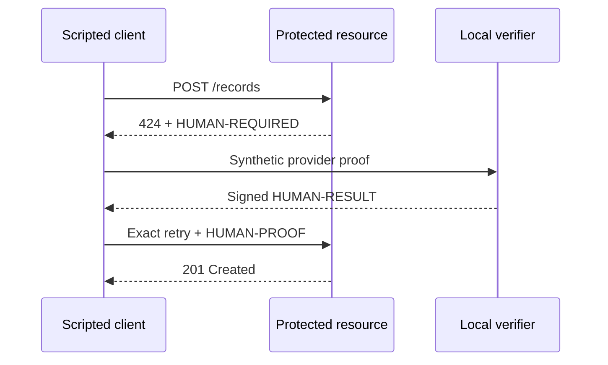

# Ten-minute local quickstart

Protect and satisfy one HTTP action without provider credentials, raw-proof
parsing, or manual token handling. This flow uses synthetic World fixtures and
the public x424 client/server interfaces. It is a developer-preview test, not a
production deployment or real World verification.

## Prerequisites

- Node.js 22 or newer
- pnpm 9 or newer through Corepack

## Run the complete flow

```bash
git clone https://github.com/x424protocol/x424.git
cd x424
corepack enable
pnpm install
pnpm quickstart
```

Expected final output:

```text
"status": 201
x424 quickstart passed: 424 challenge → proof → bound retry → 201
```

The command starts an ephemeral local resource and verifier, then executes the
same sequence a browser, wallet, backend, or agent client follows:



The script selects an unused local port, uses only development in-memory state,
and shuts the stack down when the flow finishes. CI runs the same command on
every pull request.

## What x424 handled

- the `424 Failed Dependency` challenge;
- accepted-method discovery;
- provider-proof submission;
- exact method, URI, body, audience, purpose, and caller binding;
- signed result issuance and verification;
- dependency and result replay protection; and
- the exact-request retry.

The application still owns authentication, authorization, and business
idempotency.

## Move toward a real integration

| Goal                                        | Next public artifact                                             |
| ------------------------------------------- | ---------------------------------------------------------------- |
| Inspect the World browser flow              | [`examples/world-browser/`](../examples/world-browser/README.md) |
| Protect an Express, Fetch, or Next.js route | [Adoption guide](ADOPTION.md)                                    |
| Run the Redis-backed verifier               | [Self-hosted verifier](../deploy/verifier/README.md)             |
| Compose unique humanity before payment      | [x424 + x402 examples](../examples/x402/README.md)               |
| Evaluate production controls                | [Security model](SECURITY.md) and [current status](STATUS.md)    |

Real World staging verification requires an adopter-controlled World app, RP,
action, and backend signing key. x424 constructs and validates the signed
request material; the RP signing key stays on the adopter backend.
