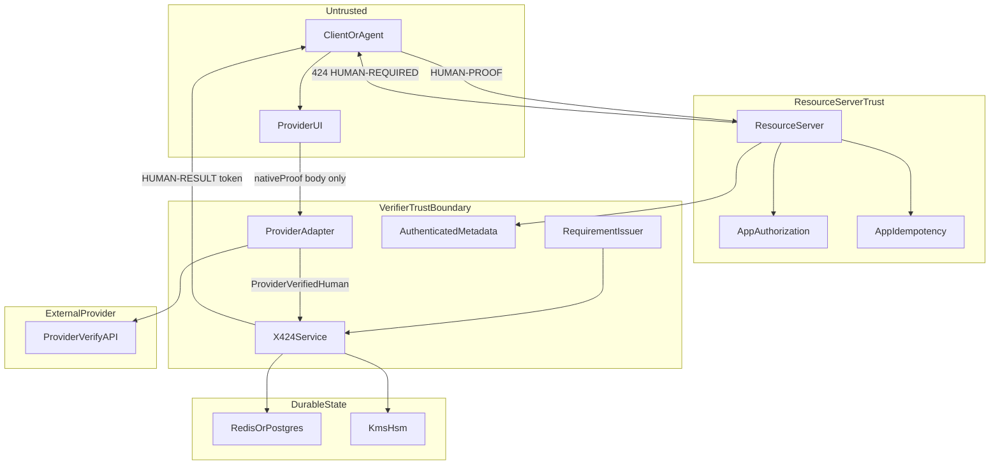
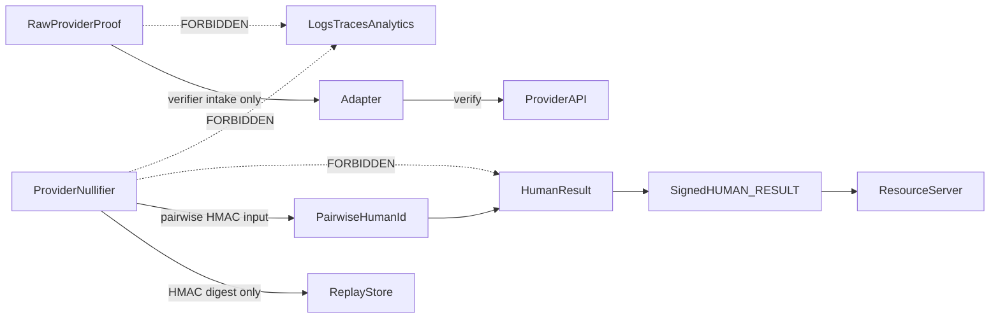

# Threat roles and sensitive data flow

Version: `threat-data-flow-0.1`  
Status: program baseline  
Normative security invariants: [SECURITY.md](../SECURITY.md)

## Roles

| Role                 | Trust expectation                                            | Must not receive                                       |
| -------------------- | ------------------------------------------------------------ | ------------------------------------------------------ |
| Resource server      | Issues challenges; verifies HUMAN-PROOF against trusted keys | Raw provider proofs, nullifiers, pairwise secrets      |
| Client / agent       | Detects 424; runs provider UI; submits proof to verifier     | Signing keys, pairwise secrets, verifier private state |
| Provider UI / wallet | Produces provider-native proof for selected method           | x424 result-signing keys; other tenants’ subjects      |
| Verifier             | Consumes requirement; verifies native proof; issues result   | Nothing outside its intake for raw proofs              |
| Provider backend     | Verifies native proof authenticity                           | x424 pairwise secrets; unrelated RP results            |
| State store          | Atomic nonces, requirements, subject digests, result IDs     | Raw proofs, plaintext nullifiers, signing keys         |
| Key system / KMS     | Result signing and pairwise HMAC custody                     | Application authorization decisions                    |
| Operator             | Deploy, rotate, observe                                      | Raw proofs in logs/metrics; exported prod private keys |

## Trust boundaries

## Sensitive data flow rules

## Explicit prohibitions

1. Raw provider proofs enter only the designated verifier intake and never leave
   the trusted verifier boundary.
2. Provider nullifiers remain inside the adapter/verifier boundary; stores hold
   HMAC digests only when verifier-side retention is required.
3. Pairwise derivation inputs and secrets never appear in results, logs, traces,
   analytics, errors, or queues.
4. Clients must not supply provider origins, signing keys, verifier keys, or
   method descriptors outside trusted server configuration.
5. Resource servers trust configured issuers and keys; never a key presented
   alongside its own result.
6. Operators may access metrics and redacted errors only; proof-safe telemetry
   is mandatory for production profiles.

## Operator access

Production profiles must document who can rotate keys, change allowlists, read
state, and export backups. Backup media is in-scope for nullifier-digest and
key-material handling. Compromise response windows are defined in runbooks.
